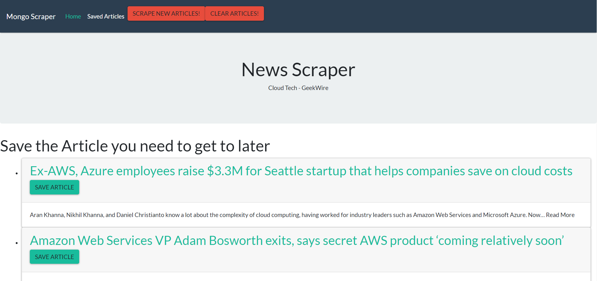
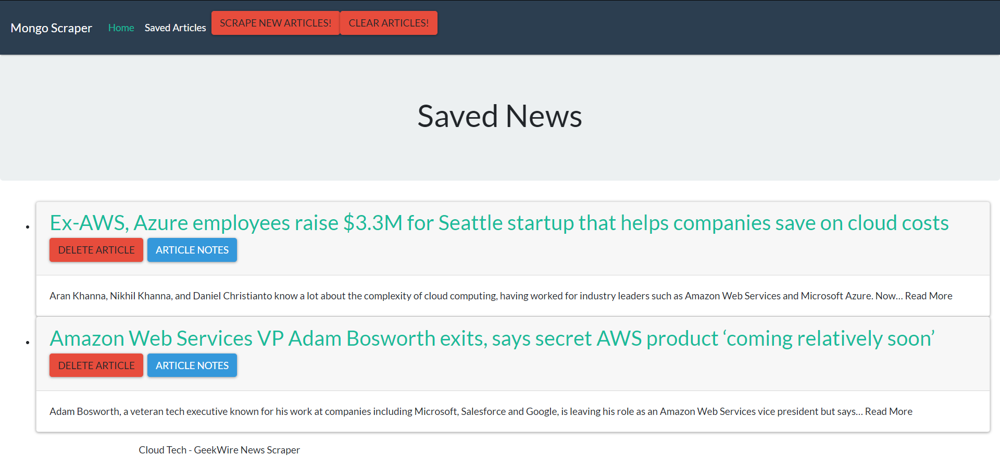
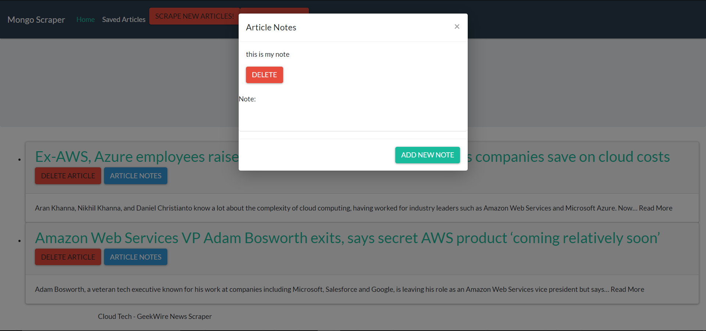

# NewsArticles

## Overview
Web app that lets users view and leave comments on the latest news that had been scrape news from another site [GeekWire](https://www.geekwire.com/), By using Mongoose and Cheerio.


## Getting Started
These instructions will get you a copy of the project up and running on your local machine.

### Installing
Git clone the repository to your local machine:

HTTPS:
```
https://github.com/AmjedAyoub/NewsArticles.git
```
SSH:
```
git@github.com:AmjedAyoub/NewsArticles.git
```

## Screen-shots

### Scraping Articles Page


### Saved Articles Page


### Article Notes Page


## Technologies & Tools
* HTML  
* CSS
* JavaScript
* Mongoose 
* Node
* Express
* Express-Handlebars
* Cheerio 
* Axios

## Links
This application is deployed on Heroku, [Try it yourself](https://cloud-news-scraper.herokuapp.com/).\
This application is published on [GitHub](https://github.com/AmjedAyoub/NewsArticles).

## Authors
See contribution history [here](https://github.com/AmjedAyoub/NewsArticles/graphs/contributors).